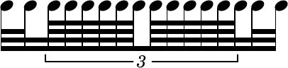
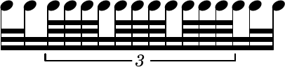
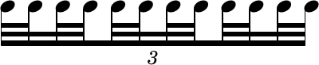
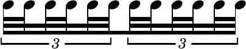
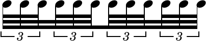
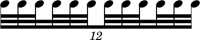
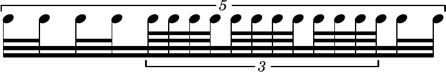

This document describes reconsiderations to the reimplementation of LilyPond's beaming-pattern code to finally get proper beam subdivisions. In January 2016 I had already worked on the topic but failed to complete it, re-reading the code now seems to suggest a new approach based on a proper *conceptual* assessment.

The old work can be found in the `dev/urs/beaming-pattern` branch, and specifically up to commit `6610d2faa4782d3414686b63ba622c354bbce9bb` (Jan 26, 2016), later commits are merely merge commits to keep the branch in sync with later development. However, I suggest *not* to continue working on that branch but to restart from scratch on a new branch.

Most of the relevant code is in `lily/beaming-pattern.cc` and `lily/include/beaming-pattern.hh`, and this document is based on a re-reading of these files.

## General Observations

Before going into any detail I want to state a few observations made from comparing the code in `master` with that in my working branch, considering what I tried to do last year and re-evaluating what the existing code tries to do.

### Coding

Generally speaking I think the code is quite convoluted and probably the result of numerous attempts at patching and fixing. It definitely needs a reimplementation rather than even further patches, and I *hope* it can be made substantially more straightforward.

The most fundamental aspect is rethinking in what order information will be processed. My impression is that the existing code sometimes calculates values (such as flag direction) and later has to touch that information again. The goal should be to avoid such inefficient and confusing behaviour as much as possible. For example flag directions should be determined as late as possible.

Maybe this convolution is related to the two layers of basic beaming pattern (with subdivisions) and specific cases such as incomplete beams, internal rests etc. So my approach (at least in this document) is to first come up with a basic structure and then handle the specifics. Of course it has to be seen if that approach can be applied to implementation or if that would cause its own level of convolution.

### Musical Concepts

I can see three musical problems of the basic beaming pattern in the current implementation:

* Beam subdivisions should be on by default.  
  (well, actually this isn't an error, but a feature request, and it should be discussed. But note that Elaine Gould confirmed that this *should* be the default, and Dorico does it by default, too.)
* Shortened beams cause a wrong number of beams within the last beat. This is due to an explicit (and - wrongly - intended) check in the code. The basis for the calculation of the beam count is the remaining length of the beam, while actually trailing unbeamed rests should also be taken into account.
* The handling of tuplets is totally messed up. It is wrong to consider stems within tuplets by their absolute metric position.

I am not sure to what extent the handling of the finer details (treatment of different note values (flags), single beams at a subdivision, shortened beams and rests) are currently treated correctly, but I think we should think this from the ground up and see *then* how these details work and have to be implemented

### Approach

#### Determine Subdivisions First

I think the first step should be to determine the *positions* of subdivisions and then the number of nominal beams to be applied. I further suggest to store this information in the `Beam_rhythmic_element` object to the *right* of the subdivision (as that is the stem representing the metric position). Only later should we consider flag directions, invisible stems etc.

##### Some notes:

* The remaining length of the beam should *never* be considered (as is currently in LilyPond (and also Dorico)). When a stem is shortened by rests the number of beams at prior subdivisions should *not* be increased.
* Also we don't want to use the *absolute* position in the *measure*, since that may confuse the calculation with compound meters with differing denominators. Instead we always want to calculate the rhythmic importance relative to the current *beat*. (see code example after next item)
* We need to add an additional property for the subdivision frequency because in some cases (especially compound time signatures) this *must* be independent from `baseMoment`. In the following example it makes sense to subdivide by 1/8 or 1/16, and this is currently not possible to implement because that time signature is only possible with `baseMoment = 1/32`:

```lilypond
     \relative a' {
       \compoundMeter #'((2 4) (5 32))
     % This doesn't work since we have to use 1/32 as baseMoment
     % and therefore implies subdivision at that rate too
     %  \set subdivideBeams = ##t
       \set baseMoment = #(ly:make-moment 1/32)
       \set beatStructure = #'(8 8 5)
       \repeat unfold 16 a32
       \repeat unfold 5 a32
     }
```

* This separation adds another situation that has not been possible so far: the beat length may not be a multiple of the subdivision length. In the above example the third beat is 5/32 long. So when we subdivide by 1/8 or 1/16 the division doesn't fit into the beat without remainder. In this case the beat can't be subdivided at all. This has to be determined for each beat in the processing outlined below.
* Separating `baseMoment` from subdivision length also makes it possible to provide reasonable presets for subdivisions in the `beamExceptions` for a given time signature. In fact I think this should be added, both as a property and to all defined preset time signatures.
* If it is reasonably possible to implement the most natural way would be to use `subdivideBeams` for this. `\set subdivideBeams = 1/8` would then both switch the subdivision on and set the value. I'd say `\set subdivideBeams = 0` would then switch it off. That would also lend itself nicely to the `if` condition in C++.
* Independently from how the subdivision interval is stored internally a practical interface would be a function
    `subdivideBeams = #(define-void-function (ctx interval)((symbol? 'Score) moment-or-boolean?) ... )`. This makes it easy to switch subdivision on and off and at the same time define the interval. The optional `ctx` can limit the scope to specific contexts.

##### How to do this in general (i.e. no tuplets involved)

* Iterate over the whole beam
* Determine for each beam its position (Moment) relative to the current *beat*. For example in 4/4 time the first note in `r4 r32 a32[ a a ...` is 1/32 into the beat.
* The *denominator* of this Moment is the *rhythmic_importance* of the stem, `32` in the above example. This works because `Moment` implicitly shortens, so 4/8 is automatically converted to 1/8 etc.
* When the rhythmic importance is smaller than or equal to the denominator of `baseMoment` the stem is to the right of a subdivision, so we can store that information in the current beam info.  
  Optionally it may make sense to store the information also in the stem to the left.
* The nominal beam count for the subdivision can be calculated by `intlog2(rhythmic_imporance) - 2`, which is true for the left beamlets of the current stem and the right beamlets of the previous stem.
* The position *on* the beat (determined by getting a Moment of 0 (I don't know what denominator the `Moment` object will then assume)) needs special consideration. In this case the rhythmic importance is determined by the *length* of the beat.  
**TODO:** Reconsider this. In regular settings the  
For regular beats this is pretty clear (e.g. a beat of 1/8 has an importance of 8). But for example, when 5/32 are grouped in 2+3 (baseMoment = 1/32, beatStructure = 2,3) the lengths of the beats are 2/32 (= 1/16) and 3/32. For both beats we will want a rhythmic importance of 1/16 (= 2 beams) because they are `>= 1/16 < 1/8`.  
  To achieve that we shorten the fraction by 2 (and flooring the numerator each time) until the numerator becomes 1. The most efficient way to do that in a loop where both numerator and denominator are shifted right until the numerator is 1.


**Note:** *At the end* of the calculation we have to ensure that at least one beam is kept in place. When (manual) beams exceed a quarter note this calculation may lead to beam counts of <= 0, which is never intended when there is a beam in place (note that the actual choice of beaming has already been made when this code is executed).

**Note:** The above has been written without actual reference to the current code. Much of that may be reused as it is not completely wrong. But I wanted to have a fresh, conceptual look on the matter.

##### When Encountering Tuplets

The code for handling tuplets has to be rewritten from scratch, as this is conceptually wrong in the existing code.

```lilypond
     \set subdivideBeams = ##t
     \set baseMoment = #(ly:make-moment 1 8)
     \tuplet 3/2  {
       c32 ^\markup "Default (baseMoment 1/8)"
       c c c  c c c c  c c c c
     }
```

This example should be engraved like this:


which I had to produce by manually setting the stem's right and left beam count. By default LilyPond incorrectly produces this instead:


LilyPond treats stems within tuplets by their *absolute* (i.e. translated) position, therefore it finds a subdivision in the middle of the beam (at position 1/8). But in fact - similar to how grace notes are handled - we are only interested in their *printed* length. The beam has an absolute length of 1/4, but we have to treat it as one of 3/8. In order to properly handle this (and other specifics of tuplets) a number of additional steps are necessary.

A tuplet is handled separately, like a beam within a beam. As far as I can see such a tuplet-beam should be treated like an independent measure (or special extended beat), regardless of where it starts and where it ends. Again, LilyPond's default produces wrong results:

```lilypond
\set subdivideBeams = ##t
\set baseMoment = #(ly:make-moment 1 16)
c32 c
\tuplet 3/2  {
  c64 c c c  c c c c  c c c c
}
c32 c
```



Again, LilyPond finds a subdivision at the *absolute* 1/8. Instead, the tuplet should be treated as an independent group of 3/16, with two 1/16th subdivisions in between. The second-to-last note of the beam, the one right after the tuplet, should be treated just like usual, representing a 16th subdivision as well:



Essentially when encountering a tuplet this has to be handled independently (see discussion below, by calling a separate method?), and the processing of stems will be picked up after the end of the tuplet. *Probably* this can be propagated to nested tuplets as well, but I haven't thought this through yet.

##### Handling Tuplets

OK, tuplets can't be simply translated to their stem's absolute positions in the measure, but what is the reference then? I have come to the conclusion that we have to consider them in slices of their `tupletSpannerDuration` (**NOTE**: I don't know where we can get this information from in C++).

Figure \ref{grouped-tuplets} shows `\repeat unfold 12 c32` with `\tupletSpan`s of 1/4 (default), 1/8, and 1/16.


Beam subdivisions follow this grouping.

The combination of the default tuplet span of 1/4 with a division by 1/8 has already been shown above (fig. \ref{triplets-correct-subdivision}):


With subdivisions by 1/16 it should look like fig. \ref{triplet-grouping-1}:



Changing the tuplet span to 1/8 should not only change the tuplet spanner grouping but also the beaming (fig. \ref{triplet-grouping-2}):



When changing tuplet span to 1/16 the triplets are not subdivided anymore, (this happens to be the only example that is currently rendered correctly by default). However, note how subdivisions occur at the borders of the triplet spans (fig. \ref{triplet-grouping-3}):




*Interpretation:*

* A tuplet is split into parts of the length of `tupletSpannerDuration`. As far as beaming-pattern is concerned any tuplet has to be treated as a sequence of tuplets that have to be processed one after another.
* The *first* stem in each tuplet is treated like a regular stem outside of the tuplet. This means it is necessary to know the absolute position in the `beatStructure` *(I'm not sure if the position has already been calculated when `beamify` is executed)*.
* Each tuplet span is processed individually like a single beat. Its length corresponds to the *visual* representation (`tupletSpannerDuration * tuplet fraction`), so for example a 3/2 tuplet over a span of 1/8 results in a “beat” of 3/16. The `baseMoment` for this beat is determined by the virtual beat length divided by the numerator of the tuplet fraction, in the given example `3/16 / 3 = 1/16`
* As stated above subdivisions may only occur when the beat length is a multiple of the subdivision length (recall that this is not identical to `baseMoment` anymore). When in the given example a subdivision of 1/8 is requested the triplet won't be subdivided anymore since 3/16 is not a multiple of 1/8.


##### Tuplets That Can Be Shortened

Sometimes tuplet fractions are used that can be shortened, for example 6/4. As far as I can see this doesn't make any difference for regular beams, but it should do so when it comes to subdivisions. The above example with a tuplet fraction of 6/4, a tuplet span of 1/4, and subdivisions of 1/16 should be beamed exactly like with a 3/2 tuplets spanning 1/8 (fig. \ref{shorten-tuplets}). With a tuplet of 12/8 the result should match a tuplet span of 1/16 (fig. \ref{shorten-tuplets-12-8})




* Before a tuplet is split into its `tupletSpannerDuration` slices it has to be checked whether the tuplet fraction can be shortened.
    * while numerator(tuplet) is odd:
        * shorten tuplet fraction by 2
        * expand tupletSpannerDuration by 2
* A `\tuplet 6/4 4` should be resolved to two `\tuplet 3/2 8`, for example, `\tuplet 12/8 4` to four `\tuplet 3/2 16`.
* Note that this operation *only* applies to the calculation of beam subdivisions, any other aspect of tuplet processing is not affected.

##### Nested Tuplets

Nested tuplets should be treated conceptually just like regular tuplets: any subdivision consideration is done relative to the visual representation, regardless of the absolute position in the measure (fig. \ref{nested-tuplets})



When encountering a nested tuplet the inner tuplet is set aside and processed just like a regular tuplet, just not relative to the overall beam/measure but to the enclosing tuplet.

Maybe it makes sense to consider a tuplet as an “inner measure” and create an object similar to a new beaming-pattern. That way one wouldn't have to worry about nested tuplets and have them recurse automatically. But I haven't thought about how to best *implement* this, currently I'm exclusively thinking about the musical concepts.

#### Calculating Actual Beamlet Counts

What we have by now is each stem's actual duration and regular beam count. Additionally we have identified stems to the right of subdivisions together with their nominal beam count. However, the actual number of beams printed to the right and left of a stem may vary depending on several factors such as the beam count of the stems to the right and left, shortened stems and the property `strictBeatBeaming`.

I have not looked into this topic yet, but maybe it's possible to simply reuse the current logic and (partially) code for that anyway. In any case the topics so far should be fixed before proceeding with the finalization stage.
