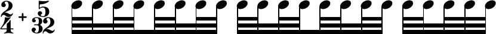

In January 2016 I worked on the code which is responsible for beaming patterns in [GNU LilyPond](http://lilypond.org). This is the code that decides how many beams any given stem gets within a beamed group - the decision *which* notes to beam has already been taken when the beaming *pattern* is calculated.

Before that I had repeatedly complained about errors in beam *subdivisons*. Several fixes had been made upon my request, and it turned out that there were always cases that produced yet another wrong result, triggering new bug reports and new patches. So I intended to go into depth and fix it properly. Unfortunately I couldn't finish that back then because it was somewhat over my head.

Re-reading code both from the `master` branch and my working branch (the relevant code is mainly in `lily/beaming-pattern.cc`) made me realize that - while intending to dig deeper - I essentially made the same mistake that is present throughout the released code: I tried to fix one issue and then looked for further problems. Essentially the beaming pattern code places patches on top of patches, while the basic outline of the algorithm gets very much blurred.

The conclusion is to start from scratch by assessing the topic from a *conceptual* perspective. It is essential to know how beaming patterns behave musically and mathematically, and only then it makes sense to design a strategy/algorithm and think about the implementation. It turns out that often fixing/patching corner and special cases can be avoided by changing the reference point in the first place. This conceptual assessment is the purpose of this document.

The most fundamental aspect is rethinking in what order information will be processed. My impression is that the existing code sometimes calculates values (e.g. flag directions) and later has to touch that information again.

Maybe this convolution of the code is related to two processing stages not being sufficiently isolated. At first *nominal* beam counts have to be calculated for each stem by identifying subdivision points and determine their metric relevance. Only then the actual number of beamlets printed to the left and right side of the stem should be considered, taking all further aspects (count of neighboring stems, single flags, trailing rests etc.) into account.

The old work can be found in the `dev/urs/beaming-pattern` branch, and specifically up to commit `6610d2faa4782d3414686b63ba622c354bbce9bb` (Jan 26, 2016), later commits are merely merge commits to keep the branch in sync with later development. However, I suggest *not* to continue working on that branch but to restart from scratch on a new branch. With regard to the actual *implementation* I suggest not to modify the existing code but to start that from scratch too while trying to reuse existing code where appropriate.


## General Observations

I can see three musical problems with beaming pattern in the current implementation:

* Beam subdivisions should be *on* by default.  
  Actually this isn't an error, but a feature request, and maybe a controversial one (given the implications on existing scores). But note that Elaine Gould confirmed that beams should be subdivided by default (“YES absolutely, (c) as default. Look how easy the rhythms are to read in comparison with the other examples!”).
* Shortened beams cause subdivisions in the last beat of a beam to have too many beams. This is wrong but actually done on purpose. Dorico currently does the same, and, by the way, the text in Gould (p. 156/157) is ambiguous because it lacks an example for this case. But she confirmed that beam shortening should not affect the beam count at subdivisions.
* The handling of tuplets is totally messed up.

I am not sure to what extent the handling of the finer details (treatment of different note values (flags), single beams at a subdivision, shortened beams and rests) are currently treated correctly, but I think we should think this from the ground up and see *then* how these details work and have to be implemented.

## Analysis

### Determine Subdivisions

In a first step we should determine the stems that represent subdivisions and the nominal beam count for that subdivision. Both values should be stored as properties of the stem to the right of the subdivision, as that is the one whose metric situation is responsible for subdivisions.

Special concern is necessary when encountering tuplets, but this will be discussed in a later section.

#### General Organization of a Beam

A beam is part of a measure, and it is especially part of the `beatStructure`. *(NOTE: I'm not clear what happens when a beam crosses a barline).* The beat structure is based on `baseMoment` and consists of a sequence of beats/groups. Usually it is defined in the time signature but it can manually be overridden.^[For further details see [“Setting automatic beam behaviour”](http://lilypond.org/doc/v2.18/Documentation/notation/beams#setting-automatic-beam-behavior) in LilyPond's notation reference.] For example in 6/8 time `baseMoment` is 1/8, and the beat structure `#'(3 3)`, i.e. two groups/beats of three quavers each.

##### baseMoment vs. subdivisionInterval

Currently the `baseMoment` property is used to determine beam subdivisions, but this is not sufficient as there are cases where the subdivision interval must be different from `baseMoment`. This is most obvious in compound meters with differing denominators. For example in the compound time signature 2/4+5/32 `baseMoment` is 1/32 and `beatStructure` can be `#'(8 8 5)` (or also `#'(8 8 2 3)`). Of course it is useful to subdivide the 2/4 part with 1/8 or 1/16, but this is currently not possible: Fig. \ref{compound-meter} shows a reasonable rendering of that measure, subdivided by 1/16. (Probably it would be better to use 1/8 as interval in real scores, but this way is better for demonstration.)



It is obvious that a new property `subdivisionInterval` has to be created that is independent from `baseMoment`. I suggest to make this an integer that corresponds to LilyPond's notion of durations. *(NOTE: this would limit beam subdivision to 1/x intervals and rule out values like 3/16. I'm not sure but doubt that's acceptable. So this has to be reconsidered, including its implications for the actual implementation.)* A convenience function `\subdivideBeams` should be added that accepts an integer or a boolean as argument and sets both context properties. `##f` would of course disable subdivision while `##t` might set it to the value of `baseMoment` (which would even make the new code more compatible with existing scores). It should be possible to encode the example with

```lilypond
\relative a' {
  \compoundMeter #'((2 4) (5 32))
  \set baseMoment = #(ly:make-moment 1/32)
  \set beatStructure = #'(8 8 2 3)
  \subdivideBeams 16
  \repeat unfold 16 a32
  \repeat unfold 5 a32
}
```

and automatically get the displayed result. In more regular time signatures this will make the process even simpler, as currently one more or less always has to switch subdivisions on *and* change `baseMoment`. In a typical file it would simply look like this:

```lilypond
\relative a' {
  \subdivideBeams 1/8
  \repeat unfold 32 a32
}
```

Reasonable presets for `subdivisionInterval` should be defined in the time signatures' `beamExceptions`.

Separating `baseMoment` from `subdivisionInterval` has another implication that may be perceived as an additional complexity but actually matches musical reality. The length of a beat is defined as a multiple of `baseMoment`, so subdivisions always fit cleanly into a beat. This is no more the case when the interval is an independent value. In the previous example the subdivision of 1/16 does *not* fit into the last beat of 3/32. This means that *whenever* the beat length is not a multiple of `subdivisionInterval` there must be *no* subdivisions in the beat, even when a stem should fall on a multiple of the interval. This check is necessary to avoid wrong subdivision as in fig. \ref{remainder-subdivision}


#### General Identification of Subdivisions - `subdivide()` (Without Tuplets)

This section describes the process of determining the nominal beam count for all stems in a beam when no tuplets are involved. The specifics of dealing with tuplets are discussed in the next section, while all further considerations regarding the actual *printed* left and right beamlets are discussed in a later part. It partly reproduces the existing method `Beaming-pattern::beamify()` and should be implemented as a new function `Beaming-pattern::subdivide()` which is called from `beamify`.

For each stem we determine the position (Moment) relative to the current *beat*. We can't work with the position relative to the *measure*, since that may produce wrong results in some cases. For example in a 5/32+2/4 time (the opposite of the compound time in the previous example) all the positions in the 2/4 part would be “off” the grid by 1/32.

The property from which we can determine whether a stem is at a subdivision is its `rhythmic_importance`. This is simply the denominator of the `Moment` obtained in the previous step. For example the moments of eight 32th notes in a quarter are `0/1` (or 0) -- `1/32` -- `1/16` -- `3/32` -- `1/8` -- `5/32` -- `3/16` -- `7/32`, and the corresponding values for `rhythmic_importance` are 1, 32, 16, 32, 8, 32, 16, 32. This works because LilyPond's `Moment` class automatically shortens its fraction *(the denominator of any Moment with numerator 0 is 1).*

A stem represents a subdivision when its rhythmic importance is less than or equal to the subdivision interval. In this case the subdivision occurs to the left of the current stem. *(NOTE: this may not work properly when we allow subdivision intervals other than 1/x.)*

Each subdivision has a nominal beam count that corresponds to the rhythmic importance of the stem and can be calculated by `intlog2(rhythmic_imporance) - 2`. The actual number of beams may be modified in a later stage, but for now we just make a note of this information. *(It has to be seen if we should actually store that in a stem property or if it's sufficient to calculate it later upon request.)*

**Note:** For moments longer than 1/8 (i.e. `rhythmic_importance < 8`) this calculation will result in a nominal beam count of 0 or less. But at some point in the end of the process we will have to ensure that at least 1 beam is printed. Recall that we don't decide whether the notes are beamed at all (and 0 beams at a subdivision would actually break the beam).

Stems *on* a beat are a corner case of this analysis and have to be treated specially. Their `Moment` relative to the beat is 0/1 (or 0), and their nominal beam count would be -2. Instead the nominal beam count of the subdivision on a beat is determined by the beat's *length*.  For durations different from 1/n we have to apply a special shortening operation that actually produces the *floor* of the matching duration. For example, in a 5/16 time with `baseMoment` 1/16 and `beatStructure` `#'(2 3)` the beats are 2/16 (= 1/8) and 3/16. But both beats have a `rhythmic_importance` of 8 because they are `>= 1/8 < 1/4`. To achieve that we shorten the fraction by 2 and floor the numerator in each iteration until the numerator becomes 1. The most efficient way to do that in a loop where both numerator and denominator are shifted right until the numerator is 1. The resulting denominator will be the `rhythmic_importance` of the beat's stem. *(NOTE: This functionality is already needed, so it is very likely that we can use the existing code.)*


**Note:** Currently LilyPond actively checks for shortened beams and increases the count for subdivisions in the last beat of the beam. This is due to a misunderstanding of an ambiguous remark in “Behind Bars” (p. 156/57) which speaks of the “duration of the groups” and doesn't state what should be done when a group is shortened by a rest. However, Elaine Gould actually speaks of the duration of the *beat*, whether it is fully beamed or shortened by rests.


#### Tuplets

The code for handling tuplets has to be rewritten from scratch, as this is conceptually wrong in the existing code.

```lilypond
     \set subdivideBeams = ##t
     \set baseMoment = #(ly:make-moment 1 8)
     \tuplet 3/2  {
       c32 ^\markup "Default (baseMoment 1/8)"
       c c c  c c c c  c c c c
     }
```

This example should be engraved like this:


which I had to produce by manually setting the stem's right and left beam count. By default LilyPond incorrectly produces this instead:


LilyPond treats stems within tuplets by their *absolute* (i.e. translated) position, therefore it finds a subdivision in the middle of the beam (at position 1/8). But in fact - similar to how grace notes are handled - we are only interested in their *printed* length. The beam has an absolute length of 1/4, but we have to treat it as one of 3/8. In order to properly handle this (and other specifics of tuplets) a number of additional steps are necessary.

A tuplet is handled separately, like a beam within a beam. As far as I can see such a tuplet-beam should be treated like an independent measure (or special extended beat), regardless of where it starts and where it ends. Again, LilyPond's default produces wrong results:

```lilypond
\set subdivideBeams = ##t
\set baseMoment = #(ly:make-moment 1 16)
c32 c
\tuplet 3/2  {
  c64 c c c  c c c c  c c c c
}
c32 c
```


Again, LilyPond finds a subdivision at the *absolute* 1/8. Instead, the tuplet should be treated as an independent group of 3/16, with two 1/16th subdivisions in between. The second-to-last note of the beam, the one right after the tuplet, should be treated just like usual, representing a 16th subdivision as well:


Essentially when encountering a tuplet this has to be handled independently (see discussion below, by calling a separate method?), and the processing of stems will be picked up after the end of the tuplet. *Probably* this can be propagated to nested tuplets as well, but I haven't thought this through yet.

##### Handling Tuplets

OK, tuplets can't be simply translated to their stem's absolute positions in the measure, but what is the reference then? I have come to the conclusion that we have to consider them in slices of their `tupletSpannerDuration` (**NOTE**: I don't know where we can get this information from in C++).

Figure \ref{grouped-tuplets} shows `\repeat unfold 12 c32` with `\tupletSpan`s of 1/4 (default), 1/8, and 1/16.


Beam subdivisions follow this grouping.

The combination of the default tuplet span of 1/4 with a division by 1/8 has already been shown above (fig. \ref{triplets-correct-subdivision}):


With subdivisions by 1/16 it should look like fig. \ref{triplet-grouping-1}:


Changing the tuplet span to 1/8 should not only change the tuplet spanner grouping but also the beaming (fig. \ref{triplet-grouping-2}):


When changing tuplet span to 1/16 the triplets are not subdivided anymore, (this happens to be the only example that is currently rendered correctly by default). However, note how subdivisions occur at the borders of the triplet spans (fig. \ref{triplet-grouping-3}):


*Interpretation:*

* A tuplet is split into parts of the length of `tupletSpannerDuration`. As far as beaming-pattern is concerned any tuplet has to be treated as a sequence of tuplets that have to be processed one after another.
* The *first* stem in each tuplet is treated like a regular stem outside of the tuplet. This means it is necessary to know the absolute position in the `beatStructure` *(I'm not sure if the position has already been calculated when `beamify` is executed)*.
* Each tuplet span is processed individually like a single beat. Its length corresponds to the *visual* representation (`tupletSpannerDuration * tuplet fraction`), so for example a 3/2 tuplet over a span of 1/8 results in a “beat” of 3/16. The `baseMoment` for this beat is determined by the virtual beat length divided by the numerator of the tuplet fraction, in the given example `3/16 / 3 = 1/16`
* As stated above subdivisions may only occur when the beat length is a multiple of the subdivision length (recall that this is not identical to `baseMoment` anymore). When in the given example a subdivision of 1/8 is requested the triplet won't be subdivided anymore since 3/16 is not a multiple of 1/8.


##### Tuplets That Can Be Shortened

Sometimes tuplet fractions are used that can be shortened, for example 6/4. As far as I can see this doesn't make any difference for regular beams, but it should do so when it comes to subdivisions. The above example with a tuplet fraction of 6/4, a tuplet span of 1/4, and subdivisions of 1/16 should be beamed exactly like with a 3/2 tuplets spanning 1/8 (fig. \ref{shorten-tuplets}). With a tuplet of 12/8 the result should match a tuplet span of 1/16 (fig. \ref{shorten-tuplets-12-8})


* Before a tuplet is split into its `tupletSpannerDuration` slices it has to be checked whether the tuplet fraction can be shortened.
    * while numerator(tuplet) is odd:
        * shorten tuplet fraction by 2
        * expand tupletSpannerDuration by 2
* A `\tuplet 6/4 4` should be resolved to two `\tuplet 3/2 8`, for example, `\tuplet 12/8 4` to four `\tuplet 3/2 16`.
* Note that this operation *only* applies to the calculation of beam subdivisions, any other aspect of tuplet processing is not affected.

##### Nested Tuplets

Nested tuplets should be treated conceptually just like regular tuplets: any subdivision consideration is done relative to the visual representation, regardless of the absolute position in the measure (fig. \ref{nested-tuplets})


When encountering a nested tuplet the inner tuplet is set aside and processed just like a regular tuplet, just not relative to the overall beam/measure but to the enclosing tuplet.

Maybe it makes sense to consider a tuplet as an “inner measure” and create an object similar to a new beaming-pattern. That way one wouldn't have to worry about nested tuplets and have them recurse automatically. But I haven't thought about how to best *implement* this, currently I'm exclusively thinking about the musical concepts.

#### Calculating Actual Beamlet Counts

What we have by now is each stem's actual duration and regular beam count. Additionally we have identified stems to the right of subdivisions together with their nominal beam count. However, the actual number of beams printed to the right and left of a stem may vary depending on several factors such as the beam count of the stems to the right and left, shortened stems and the property `strictBeatBeaming`.

I have not looked into this topic yet, but maybe it's possible to simply reuse the current logic and (partially) code for that anyway. In any case the topics so far should be fixed before proceeding with the finalization stage.
